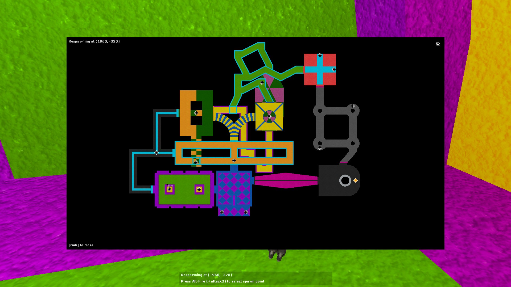
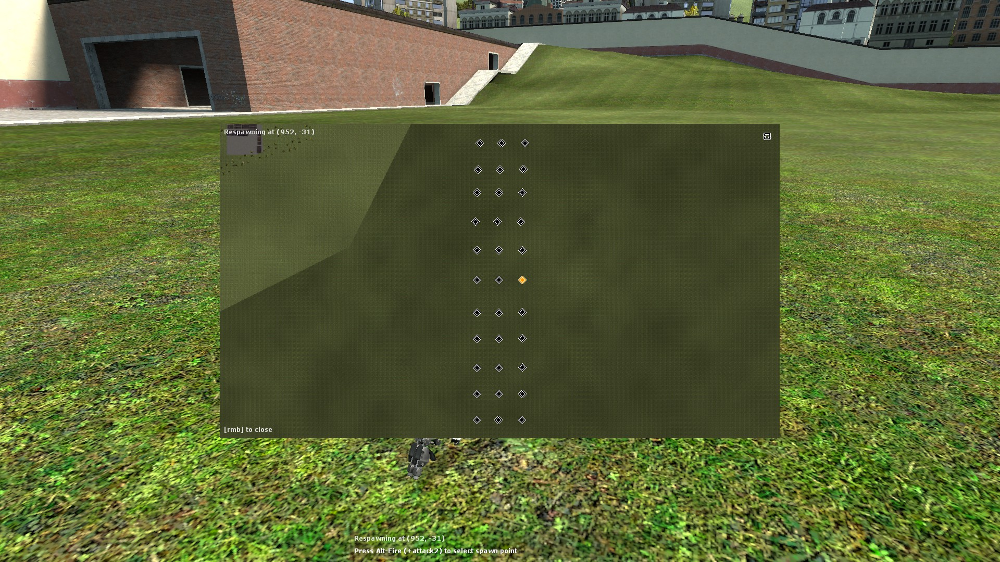
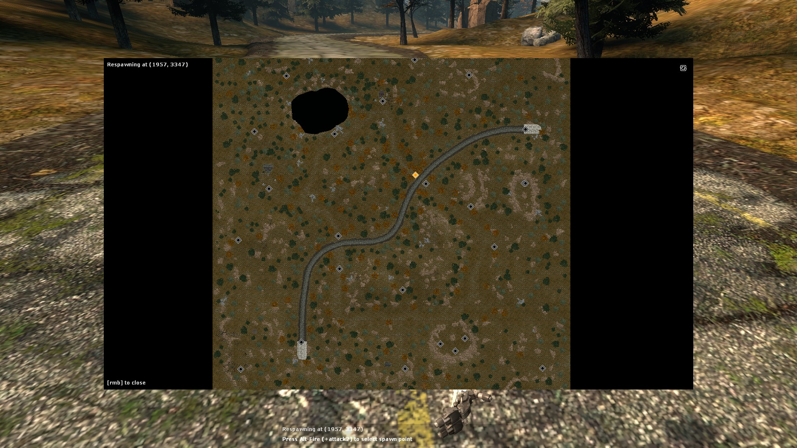

# Spawnpoint Selector (battlefield_respawn)

||||
|---|---|---|

A mod for Garry's Mod that allows you to select your spawn point.

(c) ConorSNES 2023-2026

internal name: *bfres* (**b**attle**f**ield_**res**pawn)

## Description

Allows selecting a particular spawn point to respawn from via a visual interface. On death, pressing the secondary attack button (defualt bind on m+kbd is *Right Mouse Button*) will open the overlay.

All config is available under `utilities/user/Respawn Menu Settings` and `utilities/admin/Respawn Menu Settings`. Alternatively, the CVAR values may be manipulated directly.

### CVARs

|name|desc|type|is server?|
|---|---|---|---|
|bfres_allowselect|Enable/disable use of spawnpoint selection|boolean|**Yes**|
|bfres_allowspawnteleport|Enable/disable respawning while players are alive|boolean|**Yes**|
|bfres_showui|Enable/disable hint text at bottom of screen on death|boolean||
|bfres_uiscale|Scale of spawn picker relative to screen space|numeric||
|bfres_openspawn|Open spawn picker now|trigger||
|bfres_retakemap|Retake the map the next time spawn picker is shown|trigger||
|bfres_resetspawn|Reset spawn preference|trigger||
|bfres_requestRespawn|Attempt to respawn now (see bfres_allowspawnteleport)|trigger||

## Known issues
- Addon is nonfunctional on gamemodes other than sandbox
	- This is as it is due to unpredictible hook structuring
- Addon is compatible with only up to 255 spawnlocation/s
	- It is unlikely there is more than 255 in a map, but if this needs changing, raise an issue

## Possible future features
- Translation support
- Select anywhere as a spawnpoint
